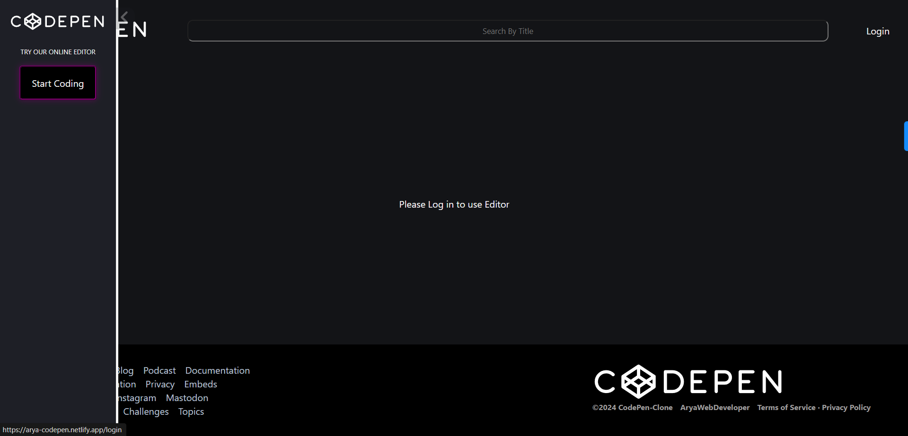
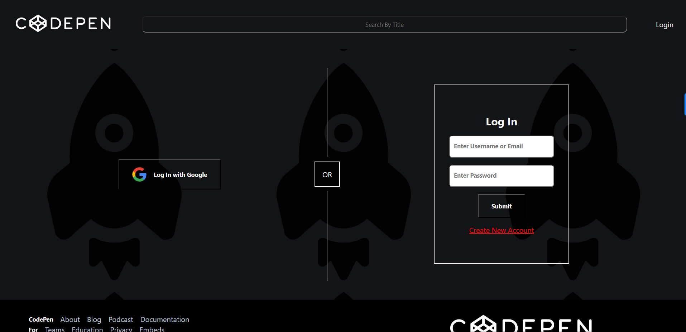
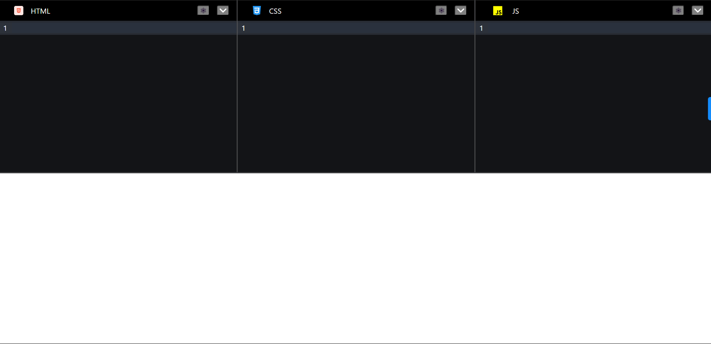
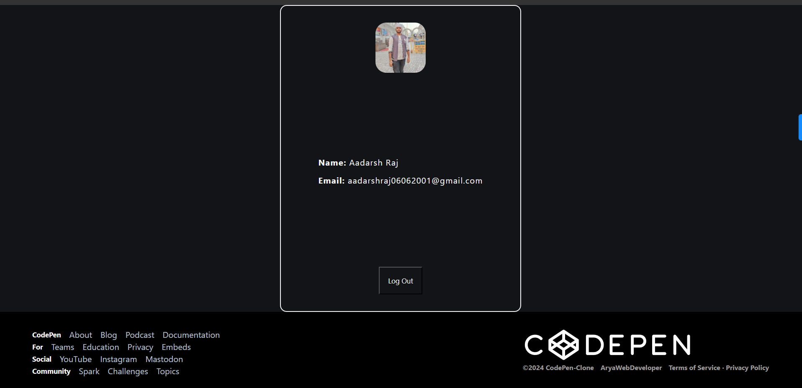

# Welcomes you to my Codepen Clone Editor for webpages

Use Arya-codepen-Clone using [Hosted Link](https://arya-codepen.netlify.app/). 

## UI Screen Shots

### Home Page

### Login Page

### Editor Page

### Profile Page

## Tech Stack Used:
ReactJs, Firebase, Context, React-router-dom, React-split-pane, @uiw/react-codemirror

#### Developed by [Aadarsh Raj](https://www.linkedin.com/in/aadarsh-raj-80b862216/)